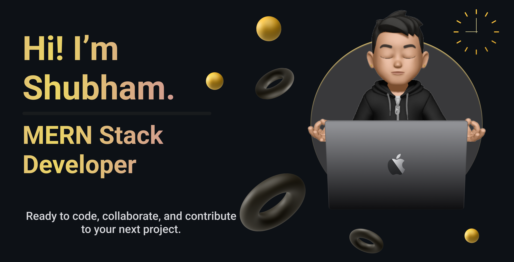

###

  
  <h3 align="center">Ready to code, collaborate, and contribute to your next project.</h3>

  <!-- <h4 align="center">🍃 I’m currently learning Rust :crab:🍃</h4> -->

  

## 🌐 Socials:

   

## 💻 Tech Stack:

### Languages

 

### Hosting
   

### FrameWorks, PlatForms & Libraries
                

### DateBase
  

### Design
 

### Others

   

# 📊 GitHub Stats:
 
 

## 🏆 GitHub Trophies

### ✍️ Random Dev Quote

### 🔝 Top Contributed Repo

---

<!-- Proudly created with GPRM ( https://gprm.itsvg.in ) -->

    